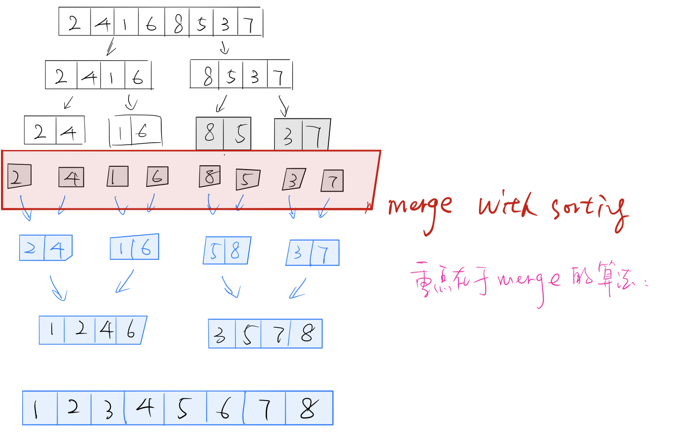

## Merge Sort

```c++
public class Solution{
  public void sortInteger(int [] A){
    if (A == null || A.length == 0){
      return;
    }
    int [] temp = new int [A.length]; //开辟新数组
    mergeSort(A,0,A.length - 1, temp); //新数组作为参数传递进排序函数
  }
  
  //分治，切分到只有一个数的情况。
  private void mergeSort(int[] A, int start, int end, int[] temp){
    if(start >= end){
      return;
    }
    mergeSort(A, start, (start+end)/2, temp);
    mergeSort(A, (start+end)/2, end, temp);
    merge(A,start,end,temp);
  }
  
  private void merge(int[] A, int start, int end, int[] temp){
    int mid = (start+end)/2
    int leftindex = start;
    int rightindex = mid+1;
    int index = start;
    
    while (leftindex <= mid && rightindex<=end){
      if(A[leftindex]<A[rightindex]){
        temp[index++] = A[leftindex++];
      }else{
        temp[index++] = A[rightindex++];
      }
    }
    
    //解决尾部。下面两个while只有一个会运行。
    while(leftindex<=mid){
      temp[index++] = A[leftindex++];
    }
    while(rightindex<=end){
      temp[index++] = A[rightindex++];
    }
  }
  
  //把temp数组的复制到A数组
  for(int i =start; i<= end; i++){
    A[i] = temp[i];
  }
  
  
}
```





## Quick Sort

```C++
#include <iostream>
#include <string>

using namespace std;

int partition(int *A, int start, int end){
  int partitionIndex = start;
  int pivot = A[end];
  for(int i=start;i<end;i++){
    if(A[i]< pivot){
      swap(A[i],A[partitionIndex++]);
    }
  }
  swap(A[end],A[partitionIndex]);
  return partitionIndex;
}

void QuickSort(int *A, int start, int end){
  if(start<end && start>=0){
    int partitionindex = partition(A, start, end);
    QuickSort(A,start,partitionindex-1);
    QuickSort(A,partitionindex+1);
  }
}

int main(){
  int A[] = {2,1,9,0,4,7,2,3};
  QuickSort(A,0,7);
  for(int i=0;i<9;i++) cout<<A[i]<<" ";
  return 0;
}
```

```python
def partition(A,start,end):
  pivot = A[end]
  partitionIndex = start
  #partitionIndex 就是如果A[i]比pivot小，扔到前面的哪个位置。
  #如果最开始几个就是比pivot小，那么i和partitionIndex同时增加，这几个数保持原位置不变。
  for i in range(start,end):#不是end+1， 不拿pivot和自己比
    if(A[i]<=pivot):
      A[i],A[partitionIndex] = A[partitionIndex],A[i]
      partitionIndex+=1
  #for循环之后最后的 A[partitionIndex]一定大于pivot，因为所有小于等于的都扔到了它的左边。
      
  #把pivot插到中间。
  A[partitionIndex],A[end] = A[end],A[partitionIndex]
  return partitionIndex

def QuickSort(A,start,end):
  if start<end:
    par = partition(A,start,end)
    QuickSort(A,start,par-1)
    QuickSort(A,par+1,end)
A = [2,1,9,0,4,7,2,3]
QuickSort(A,0,len(A))
print(A)
```


